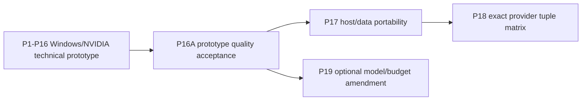

# Prototype-First Zero-Python Portable Architecture

Status: prospective v2 target design pending selected P0A acceptance.

`docs/rebuild-contract.md` and its signed P0 receipt remain immutable historical v1
authority. On P0A acceptance, `docs/rebuild-contract-v2.md`,
`docs/decision-ledger-v2.md`, and
`docs/adr/0000-prototype-first-portable-interface.md` govern this architecture. The amended
`TODO.md` defines execution order and literal gates as part of the same P0A candidate.
A conflict is a stop condition.

The existing Rust crate, root configurations, `build.rs`, kernels, schemas, and receipts
are evidence, not the rebuild implementation baseline. Historical P0, P1A, P1B, and P2
artifacts are never rewritten or reinterpreted.

## Scope and Success Boundary

Build a zero-Python pipeline that curates authorized Python source, trains a deterministic
32K byte-level BPE tokenizer, materializes enough governed token IDs for exactly
`2,000,000,000` valid next-token training targets, and pretrains the canonical
`135,285,504`-parameter decoder with zero overshoot and a fully durable resumable final
checkpoint.

The first full implementation and run use only `prototype-windows-5090-v1`: native
Windows x86_64, AMD Ryzen 9 9950X3D, Rust `x86_64-pc-windows-msvc`, the qualified VS 2022
x64 MSVC/Windows SDK toolchain, one NVIDIA GeForce RTX 5090 SM120 with dedicated VRAM,
and CUDA. Its internal host and accelerator boundaries are provider-neutral from the first
rebuild scaffold. Linux/macOS host-data portability follows only after prototype quality
acceptance; AMD and Apple accelerator qualification follows host portability.

Support is always labeled with the stable wire values `designed`, `implemented`,
`tuple_qualified`, or `full_run_qualified`. Evidence for one exact tuple does not prove another tuple or a
Cartesian platform/provider matrix. Until P16A is accepted, selecting Linux, macOS,
ROCm/HIP/AMD, or Metal/Apple Silicon fails before provider discovery or persistent
mutation with stable capability code `DEFERRED_POST_P16`; it never falls back or reports
stub success. The code names the post-P16 capability class; P16A is the earliest execution
authority.

## Zero-Python and Native Boundaries

No Python interpreter, executable, package, module, wheel, build backend, code generator,
embedded runtime, or Python-launched subprocess is part of build, data preparation,
tokenization, training, qualification, verification, or receipt publication. Python source
is input data only.

Rust owns product orchestration, platform process/filesystem adapters, general data
transformation, tokenizer/storage logic, model/trainer control, checkpointing,
verification, and publication. A platform shell script is never a normative entry point.

Native code is permitted only inside pinned, audited, feature-gated boundaries:

- CUDA, HIP/ROCm, and Metal kernels or standard native ML libraries behind narrow Rust
  adapters;
- `tree-sitter-python 0.25.0` generated C parser/runtime solely behind the Rust data-policy
  boundary for `SOURCE-002`, `SOURCE-003`, `DEDUP-001`, and `DECONTAM-001`.

The parser boundary pins and hashes grammar source, generated C and scanner, runtime,
ABI, normalized per-host build flags, and a compatibility corpus with expected CST,
comment-range, and lexical-token outputs. The build never generates parser code and never
invokes Python. C and C++ never own orchestration or unrelated data transformation.

CPU/data-only builds discover and link no accelerator SDK, provider runtime, native ML
backend, or accelerator kernel.

## Canonical Model and Arithmetic

The canonical `gqa-135m-v1` model is bias-free and pre-normalized:

- vocabulary 32,000;
- width 768;
- FFN width 2,432;
- 12 decoder layers;
- 12 query heads and 4 KV heads;
- head width 64;
- context length 2,048;
- untied token embedding and LM head.

Its exact count is:

```text
token embedding                         32,000 * 768 = 24,576,000
untied LM head                          32,000 * 768 = 24,576,000
attention per layer  768*768 + 2*(768*256) + 768*768 = 1,572,864
SwiGLU per layer                         3*(768*2,432) = 5,603,328
two norms per layer                              2*768 = 1,536
twelve layers               12*(1,572,864+5,603,328+1,536) = 86,132,736
final norm                                            768
total                                            135,285,504
```

The `gqa-124m-ref-v1` configuration has FFN width 2,048 and exactly `124,668,672`
parameters. It is never the canonical default.

Canonical storage is BF16 for parameters and activations with the frozen FP32-sensitive
accumulations and FP32 optimizer/master state. A scalar BF16/FP32 oracle fixes operation,
accumulation, reduction, contraction, and rounding order. Every parameter-gradient
artifact must equal its canonical IEEE-754 reference bytes. Forward/loss diagnostics may
use one predeclared provider-independent table; no tolerance waives exact gradients.

## Minimum Accelerator Compatibility Gate

The provider-neutral environment floor is derived only from the canonical parameter
count:

```text
P = 135,285,504
Q = 256 MiB = 268,435,456 bytes
raw = 20 * P = 2,705,710,080 bytes
minimum_accelerator_bytes = align_up(raw, Q)
                          = ((raw + Q - 1) / Q) * Q
                          = 2,952,790,016 bytes
```

Qualification allocates at least that many accelerator-visible bytes in a fresh process,
runs and synchronizes a sentinel round trip, releases the allocation, and verifies return
to the recorded baseline. Dedicated VRAM and unified memory are reported separately. This
is an environment compatibility floor, not proof of final training sufficiency, peak
memory, performance, or stability.

## Fixed SLA and Admission Gate

The final technical prototype run has a fixed completion SLA of `28,800` seconds. Entry
requires a fixed whole-run-equivalent projection of at most `25,920` seconds. The latter
is exactly 90 percent of the former and is an admission gate, not a substitute for the
actual run.

Corpus acquisition, governance, curation, tokenizer training, and token-corpus
materialization occur before the clock. The clock starts immediately before the trainer
opens and re-verifies the frozen artifacts. It includes verification, startup,
initialization, run-time compilation/autotuning, loading, all training work, configured
held-out evaluation, synchronization, checkpointing, final durability, and recovery
downtime. It is a suspend-inclusive monotonic wall clock: host suspend/system sleep and
resumed-execution downtime count, and active-process CPU time cannot substitute for it.
It ends only after the final checkpoint is durable.

The admission projection includes every charged overhead using synchronized measurement
or frozen count scaling. Calibration and roofline evidence may select a configuration and
diagnose risk; they never redefine `25,920` or `28,800` after measurement. Exactly five
fresh-process samples per overhead class feed the exact `O_bound` formula frozen in the v2
contract; admission requires both `R_qual >= R_required` and
`ceil(2,000,000,000 / R_qual + O_bound) <= 25,920`. Synchronized compute, memory bandwidth,
operational intensity, roofline, and efficiency remain diagnostic; 85-percent bandwidth
efficiency is not an independent gate.

## System Architecture


Use one product Cargo package plus one isolated developer-only `xtask` workspace member,
with strict internal boundaries:

```text
src/
  main.rs       one installed python-slm executable
  commands/     plan, curate, train-tokenizer, tokenize, inspect, bench, train
  config/       closed versioned configuration and validation
  platform/     host process, filesystem, toolchain and dynamic-library adapters
  data/         source, policy, provenance, dedup, decontamination and splits
  parser/       safe pinned Tree-sitter policy boundary
  tokenizer/    deterministic sampling, BPE and artifact validation
  storage/      u16le shards, manifests, indexes and portable mmap loader
  model/        canonical config, scalar oracle, GQA, RoPE, RMSNorm and SwiGLU
  backend/      provider-neutral traits and isolated cuda/rocm/metal adapters
  train/        staging, optimizer, schedule, evaluation, checkpoint and telemetry
tests/          synthetic, platform, parser, backend and resume parity
benches/        ingestion, transfer/memory, kernels and synchronized full step
xtask/           isolated developer-only qualification package and entry point
```

The product subcommands consume immutable artifacts rather than hidden process state.
Production configurations reject unknown fields and hidden defaults. Handled success and
failure keep one terminal success JSON object on stdout, typed JSONL diagnostics on
stderr, and the fixed exit categories.

## Host and Accelerator Abstractions

Host adapters may differ internally for process creation, process-tree containment,
timeouts/cancellation, filesystem handles, path containment, descriptor identity,
durability sync, atomic rename, dynamic-library inspection, and toolchain discovery. They
must expose identical public semantics and cleanup guarantees.

Accelerator adapters expose exact provider/device selection, allocation, copies or unified
access, synchronization, event/fence lifecycle, tensor operations, deterministic-mode
state, and native-library identity. A safe Rust boundary validates dtype, provider,
device, shape, stride, alignment, lengths, and stream/queue/command-buffer compatibility.
Ownership guards retain resources through asynchronous completion. Native errors are
mapped to public typed categories without losing provider detail in redacted evidence.

Provider-specific fallback representations are emitted only where the SDK supports them.
PTX is a CUDA representation, not a generic portability requirement. Discrete CUDA/ROCm
paths compare pageable, bounded registered/page-locked, and asynchronous rings. Apple
unified memory compares shared/managed/private buffer and command synchronization paths
without calling shared access an H2D copy.

## Data and Artifact Contracts

The v1 source authorization, provenance, encoding, license, removal, sensitive-data,
deduplication, decontamination, split, tokenizer, storage, and role-ledger decisions remain
unchanged unless explicitly superseded by the v2 ledger.

Accepted source is strict UTF-8/ASCII Python 3 under pinned
`tree-sitter-python 0.25.0`, with the frozen BOM/cookie rules and canonical decoded size
`100..=1,000,000` decimal bytes. Comment byte accounting and generated-marker scanning use
actual pinned comment nodes. Docstrings are not comments. Parser syntax acceptance never
proves safety, quality, license, provenance, or absence of sensitive material.

Dedup uses exact curated hashes first, then the frozen lexical-token 5-gram definition,
256 deterministic affine MinHash components, 32 bands by 8 rows for candidate retrieval,
and exact Jaccard strictly greater than `0.85` for the final near-duplicate decision. LSH
does not make the exact decision. Deterministic custom byte-level BPE, its 256-byte
alphabet, exact 32,000 IDs, special IDs, round trip, sample caps, and byte-identical repeat
build remain unchanged.

Token artifacts use immutable raw `u16le` shards, closed manifests, and document/sequence
indexes. Writers create same-volume partial generations, sync data and metadata, and
publish manifest-last without overwrite. Readers reject path escapes and enforce a
portable backing-file immutability invariant through stable handle/descriptor identity,
size/metadata checks, and full-hash revalidation at defined read boundaries. Inode identity
alone is insufficient.

The training prefix has exactly `2,000,000,001` stored IDs and exposes exactly
`2,000,000,000` consumed real inputs and valid targets with zero boundary exclusions.
Unused tail, unmaterialized documents/bytes, runtime PAD inputs, and masked targets are
separate counters. Complete 2,048-target spans are deterministically shuffled once; the
final 1,024-target span remains last and is padded/masked only at runtime.

## Training and Resume

The model uses causal 12Q/4KV GQA without repeated K/V materialization, adjacent-pair RoPE
base 10,000 reset at sample start, inclusive causal masking across EOS, FP32-accumulating
RMSNorm epsilon `1e-5`, SwiGLU, and chunked or fused cross-entropy that avoids retaining
full `[B,L,V]` logits.

The optimizer, decay groups, clipping, accumulation, schedule, final partial update, fixed
evaluation cadence, and checkpoint retention remain frozen by the decision ledger. A full
optimizer update represents exactly 65,536 valid targets. The run has 30,517 full updates
and one 37,888-target final update, for 30,518 total and zero overshoot.

Every checkpoint is an atomic completed-boundary generation containing parameters, FP32
master/moments, optimizer, scheduler, scaler if used, host/device RNG, exact span-manifest
identity and next cursor, counters, configurations, backend-visible deterministic state,
environment identity, and artifact hashes. A resumed execution must be byte-for-byte
identical to uninterrupted execution for every subsequent tensor/state, gradient,
evaluation result, counter, cursor, and checkpoint. Mismatched environment, backend,
configuration, span, or artifact identities fail closed.

## Prototype, Quality and Portability Sequence



### P1 through P16

The prototype path qualifies only `prototype-windows-5090-v1`. P16
is the technical two-billion-target receipt and must pass actual durable elapsed time
`<=28,800` seconds after admission projection `<=25,920` seconds. It does not approve
model quality and does not unlock P17 or P19.

### P16A

Before P15 begins, freeze and hash the complete P16A quality pack: immutable held-out
validation/test manifest; exact aggregate-loss and perplexity calculation; initialized-
model checkpoint identity and aggregate held-out loss; frozen unigram model/artifact and
aggregate held-out loss; exact predicate; qualitative prompt/sample pack; deterministic
generation settings; output schema; rubric; and receipt fields.
The exact pack, prompt/sample, decoding, output-schema, and rubric hashes require a named
owner approval before P15 begins; that approval is separate from approval of P16A results.
After P16, a fresh process
loads the selected final checkpoint. Its aggregate held-out loss must be finite and
strictly below both the initialized-model and frozen-unigram aggregate losses, and its
aggregate held-out perplexity must be finite. It also emits outputs for the frozen
qualitative pack. A named owner then records explicit quality approval with identity,
signature/reference, and UTC timestamp. No quality-pack byte changes after P15 begins.
P16A alone unlocks P17 or optional P19.

### P17

P17 implements and qualifies host/data behavior on one final source identity across
Windows x86_64 MSVC, Linux x86_64 GNU, and macOS arm64 Apple. The complete CPU/data and
synthetic pipeline runs natively, with Python canaries and parser/path/mutation/crash/
cleanup fixtures. Provider-independent data artifacts and hashes are byte-identical. P17
does not qualify an accelerator or a two-billion-target run on the changed source.

### P18

P18 depends explicitly on both P16A and P17 and freezes an exact tuple manifest before
measurements. Four lanes are mandatory on the final source: Windows/NVIDIA CUDA
regression, Linux/NVIDIA CUDA, Linux/AMD ROCm/HIP, and macOS arm64/Apple Silicon Metal.
Each tuple independently passes native launch, dependency isolation, literal canonical
gradient bytes, exact state round trip, byte-identical resume, provider-appropriate memory
path, synthetic E2E, cleanup, synchronized calibration, and qualification ladder. P18 does
not imply unlisted tuples, equal performance, cross-provider checkpoint migration, or 2B
completion on AMD/Apple.

### P19

P19 is optional, depends directly on P16A, and is reserved for increasing model size,
valid-target count, or time budget. It creates a new contract/ledger/ADR and reruns affected
gates. It is not portability work and not a portable-source P16 rerun.

## Verification and Receipt Model

Correctness, environment compatibility, deterministic resume, memory, sustained
performance, model quality, host portability, accelerator tuple qualification, and full
run are separate claims and separate evidence.

Normal CPU/data CI runs on native Windows, Linux, and macOS profiles once P17 owns that
matrix. Accelerator jobs are separately provisioned and always report one exact tuple.
No external CI runner is registered or invoked without explicit authorization. Local
native execution of the same `xtask` case is acceptable evidence.

Every immutable run binds exact argv, cwd, source/tree/dirty state, `Cargo.lock`, contract,
ledger, ADR, architecture, schemas, parser bundle, configurations, artifacts, host and
accelerator identities, native dependencies, transcripts, exit codes, gates, cleanup, and
seal. Failed and superseded runs remain immutable and never move a selected pointer.
Aggregate portability acceptance binds a frozen matrix manifest and every child receipt
hash from one common source identity.

The final prototype provenance receipt includes every v2 `PROV-001` identity and role
counter, the exact `2,952,790,016`-byte environment memory floor, admission projection,
actual continuous elapsed time, and durable final checkpoint. P16A adds the pre-P15
quality-pack hash, both baseline identities/losses, final aggregate loss/perplexity,
qualitative output hashes, and owner approval. Later portability
receipts cite P16A but do not reinterpret its source or full-run scope.

## Explicit Non-Goals

- Qualifying every operating-system/provider combination before one prototype is complete.
- Treating a feature flag, compile check, advertised capacity, or documentation as tuple
  qualification.
- Treating P16 technical completion as model-quality approval.
- Treating P17/P18 as a portable two-billion-target receipt.
- Cross-provider in-flight checkpoint migration without a separate contract.
- Changing the canonical model or time budget during portability; that belongs only to P19.
- Calling mmap, ordinary vectors, shared buffers, or unified memory page-locked transfer.
- Relaxing gradient bytes, deterministic resume, governance, hash, or accounting gates for
  a new provider.

## Historical Validation Record

Historical v1 evidence is preserved in immutable receipt paths. The authoritative P0
machine run remains `20260811T074740Z-d5008e94`, sealed by
`184dc926bb9e5e2963a61182398580f7dedbf5aa5992f062dacfc6db6f1430f5`.
The v1 contract and ledger hashes remain
`fc2c60b52fdd7c524e0da06bb03972a4d523c21ad5536cba536185435bd44ad4`
and `8349d8a3e06d96d6921889de5534715e7b2f7439caf7e06558a97652a8890c8d`.

Historical selected P1A/P1B evidence qualified one Windows/MSVC/CUDA Toolkit 13.1,
driver 610.88, RTX 5090 SM120 environment. It demonstrated native `sm_120`, supported PTX
fallback launch, synchronization, and required CUDA library boundaries. It did not select
a rebuilt backend or prove model parity, training memory, throughput, SLA completion,
quality, Linux/macOS behavior, AMD/Apple support, or portable release status. Historical
P2 attempts likewise remain attempts and are not reinterpreted as v2 qualification.
