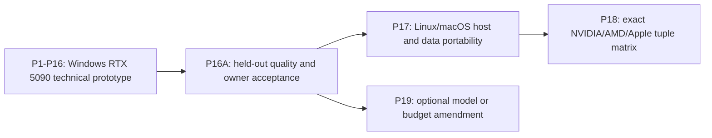

# ADR 0000: Prototype First, Portable Interface from Day One

Status: **Accepted design; pending P0A authority acceptance**

Date: 2026-08-13

Deciders: project owner, technical authority, data-governance authority

## Context

The historical contract and receipts prove a Windows/MSVC/CUDA/SM120/RTX 5090
environment boundary. They do not prove a rebuilt training backend, a completed run,
Linux or macOS behavior, AMD or Apple support, or a portable release. Attempting all host
and accelerator combinations on the first critical path would multiply toolchain,
backend, kernel, memory-model, and receipt risk before one complete product exists.

The opposite shortcut, implementing a Windows/CUDA-shaped product and abstracting it
later, would make public artifacts, errors, checkpoint state, and qualification receipts
provider-specific. That would turn portability into a semantic rewrite and invalidate the
prototype evidence.

## Decision

Implement and finish only profile `prototype-windows-5090-v1` through P16: native
Windows x86_64, AMD Ryzen 9 9950X3D, Rust `x86_64-pc-windows-msvc`, qualified VS 2022
x64 MSVC/Windows SDK, one NVIDIA GeForce RTX 5090 SM120 with dedicated VRAM, and CUDA.
From the first rebuild scaffold, keep host mechanisms and accelerator
providers behind provider-neutral Rust interfaces with isolated `cuda`, `rocm`, and
`metal` features. Public argv, schemas, errors, artifacts, hashes, accounting, checkpoint
state, deterministic semantics, and receipt publication do not vary by provider.

Until P16A is accepted, selecting Linux, macOS, ROCm/HIP/AMD, or Metal/Apple Silicon
returns stable capability error `DEFERRED_POST_P16` before provider discovery or
persistent mutation. The code names the post-P16 capability class; P16A is the earliest
execution authority. There is no silent fallback or successful stub.

The canonical model remains exactly `135,285,504` parameters. The environment memory
compatibility floor is:

```text
P = 135,285,504
Q = 256 MiB = 268,435,456 bytes
minimum_accelerator_bytes = align_up(20 * P, Q)
                          = 2,952,790,016 bytes
```

The P16 completion SLA remains a fixed `28,800` seconds. Entry to P16 requires a fixed
whole-run-equivalent projection of at most `25,920` seconds. Calibration may diagnose
headroom and select configuration, but it cannot redefine either threshold. The frozen
`O_bound`/`R_required` formula uses maxima from exactly five fresh runs per overhead class;
admission requires both the rate and ceiling-projection predicates. Compute, bandwidth,
operational-intensity, roofline, and efficiency evidence is diagnostic, and no 85-percent
relative-efficiency target is an independent gate.
The P16 timer is a suspend-inclusive monotonic wall clock; recovery, host suspend/system
sleep, and resumed-execution downtime count until the final checkpoint is durable.

Zero Python is absolute for executable behavior: no Python interpreter, executable,
package, module, build backend, generator, embedded runtime, or Python-launched child.
Native accelerator libraries and kernels are permitted only behind audited provider
boundaries. The sole data-path native exception is pinned `tree-sitter-python 0.25.0`
generated C parser/runtime through a Rust-owned policy boundary for frozen CST, comment,
and lexical semantics.

## Phase and Evidence Boundary



- **P16** proves technical completion only on its exact Windows prototype source and tuple:
  target accounting, artifact integrity, deterministic checkpointing, provenance, and
  actual durable elapsed time at or below `28,800` seconds.
- **P16A** depends on P16 and is the quality acceptance. Before P15 begins, freeze one
  hashed pack containing the held-out manifest and aggregate calculations, initialized and
  unigram baseline identities/losses, exact predicate, qualitative prompt/sample pack,
  deterministic generation settings, output schema, and rubric. A named owner approves
  the exact prompt/sample, decoding, output-schema, and rubric hashes before P15; this is
  distinct from the later P16A result approval. In a fresh process, the
  final aggregate held-out loss must be finite and strictly below both frozen baselines,
  and aggregate held-out perplexity must be finite. Frozen qualitative outputs and a named
  owner's explicit approval are also mandatory. P16A alone unlocks P17 or optional P19.
- **P17** depends on P16A and implements/qualifies host and data behavior on native Windows
  x86_64, Linux x86_64, and macOS arm64 profiles. Provider-independent data artifacts must
  be byte-identical. It makes no accelerator or full-run claim.
- **P18** depends explicitly on both P16A and P17 and qualifies a pre-frozen four-lane
  matrix: final-source Windows/NVIDIA CUDA regression, Linux/NVIDIA CUDA, Linux/AMD
  ROCm/HIP, and macOS arm64/Apple Silicon Metal. It proves exact tuple correctness and
  deterministic resume, not equal speed or 2B completion on every tuple.
- **P19** is optional, depends directly on P16A, and may amend model size, target count, or
  time budget. It requires a new contract identity and affected reruns. It is neither a
  portability phase nor a portable-code P16 rerun.

P16 evidence remains valid for its exact source and tuple after later source changes, but
it does not qualify P17/P18 code for a two-billion-target run. P17/P18 likewise do not
reinterpret P16 as a portable full-run receipt.

## Interface Boundary

Rust owns process control, configuration, data movement orchestration, artifact
verification, training state, and receipt publication. Internal interfaces distinguish:

- host process/filesystem/dynamic-library/toolchain adapters;
- accelerator discovery and exact stable device selection;
- dedicated-memory transfer from unified-memory access;
- stream, queue, command-buffer, event, fence, and asynchronous ownership semantics;
- provider-neutral tensor/state serialization from provider-visible ephemeral state;
- provider errors from public typed error categories.

CPU/data builds must not discover or link any accelerator SDK or native ML backend.
Provider-specific code must propagate native errors, validate layout/device/queue
compatibility, retain resources through asynchronous completion, and release every
resource on success and all failure paths. PTX is CUDA-specific; other providers use only
representations their SDKs actually support.

## Qualification and Claim Rules

A provider feature in source means only **designed** or **implemented**. A support claim
requires an immutable selected receipt for one exact tuple. Each P18 child receipt binds
the same final source, contract, ledger, schemas, parser bundle, and canonical fixture
identities while recording tuple-specific host, SDK, runtime, driver, device, backend,
native library, and memory model.

Every accelerator tuple must pass literal canonical CPU-reference gradient bytes and
byte-identical interrupted resume. Forward/loss diagnostics may use one predeclared
provider-independent table; tolerances never waive exact gradient or resume requirements.
An aggregate matrix acceptance passes only when every required child tuple passes.

No portability receipt claims:

- support for an unlisted OS/provider combination;
- performance equivalence across devices;
- cross-provider in-flight checkpoint migration;
- a two-billion-target run on AMD or Apple;
- a larger model or longer budget.

## Consequences

Positive consequences:

- The critical path reaches one complete, measurable product before multiplying provider
  implementation risk.
- Public and persisted semantics are portable before provider code proliferates.
- Historical and prototype evidence remains honest and tuple-scoped.
- Host/data portability and accelerator portability fail independently and have separate
  receipts.
- A future larger model cannot silently weaken the accepted prototype or portability
  gates.

Costs and constraints:

- Provider-neutral interfaces and closed evidence schemas must exist before all adapters
  do.
- Common-code changes in P17/P18 require regression on previously passing profiles or
  tuples using the final source identity.
- P16A needs its complete quantitative and qualitative quality pack frozen before P15.
- P18 requires real authorized AMD and Apple hardware; documentation or compilation alone
  cannot qualify those lanes.

## Rejected Alternatives

### Qualify every platform before the prototype

Rejected because it places three host families, three provider stacks, and multiple
backend closures on the first end-to-end critical path without existing product evidence.

### Implement Windows/CUDA-specific public semantics and abstract later

Rejected because it would make portability change artifact, checkpoint, error, and receipt
meaning and would force a semantic rebuild rather than an adapter implementation.

### Let P16 automatically unlock portability

Rejected because technical target-count/SLA completion does not constitute owner-approved
held-out model quality. P16A is the explicit boundary.

### Treat P18 as a portable two-billion-run receipt

Rejected because qualification ladders and deterministic correctness do not prove a full
run on each provider. Any such claim needs its own explicit future authority and receipt.

### Use P19 for portability cleanup

Rejected. P19 is reserved for an optional larger-model or longer-budget amendment and
depends directly on P16A.
