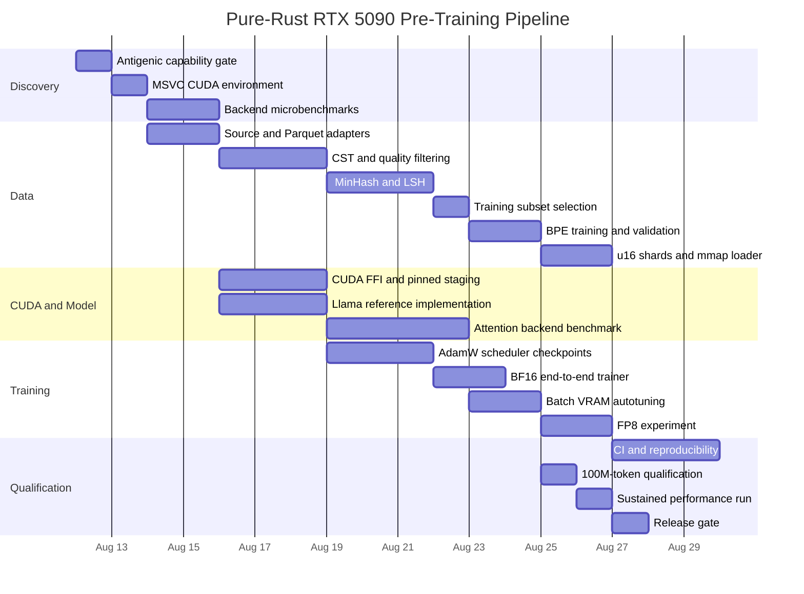

# Pure-Rust LLM Pre-Training Pipeline on Windows MSVC/CUDA: Research and Implementation Plan

## Executive summary

The project is technically plausible as a **zero-Python orchestration and training stack**, but several parts of the proposed specification need to be corrected before implementation begins.

The strongest architecture is:

**Rust/Tokio ingestion → Arrow/Parquet metadata streaming → Software Heritage content fetch → Tree-sitter validation/filtering → parallel MinHash/LSH dedup → Rust `tokenizers` BPE → raw little-endian `u16` token shards + sidecar manifests → memory map → CUDA-pinned staging ring → asynchronous H2D copy → Candle/Burn or custom `cudarc` CUDA backend → BF16 Llama-style training → optional FP8/cuBLASLt optimization.**

That direction is supported by current Rust and NVIDIA tooling: Tokio 1.51 is an active LTS line; Reqwest 0.13.4, Rayon 1.12, memmap2 0.9.11, Tokenizers 0.23.1, Candle 0.11, Burn CUDA 0.21, and cudarc 0.19.8 are current enough to make a Windows-native implementation realistic. Candle provides CUDA training and user-defined CUDA kernels, Burn's CUDA backend is implemented using CubeCL/cudarc, and cudarc directly exposes the CUDA driver/runtime, cuBLAS, cuBLASLt, cuRAND and cuDNN families. citeturn17search5turn17search7turn17search0turn17search2turn19search0turn21search1turn15search9turn21search0

There are, however, **four critical specification corrections**.

First, the requested model dimensions do **not** produce approximately 135M parameters. With `d_model=768`, `d_ff=2048`, 12 layers, 12 Q heads, 4 KV heads and a 32K vocabulary, a bias-free Llama-style implementation is approximately **100.09M parameters with tied input/output embeddings or 124.67M with untied embeddings**. To preserve `d_model=768`, 12 layers and the GQA layout while reaching approximately 135M, an especially clean variant is **`d_ff=2432` with an untied LM head**, which computes to approximately **135.29M parameters**.

Second, **The Stack v2's Hugging Face Parquet files are not simply Parquet files containing all source text**. The official dataset states that its released datasets contain Software Heritage identifiers and that file contents are stored through Software Heritage infrastructure; bulk downloading has explicit terms, licensing/provenance requirements, and an agreement requirement for bulk access. The Stack v2 is therefore best treated as an **index/provenance source plus a Software Heritage content-fetch layer**, rather than as a single HTTP-Parquet-to-source-code pipeline. citeturn16search0turn16search1

Third, `memmap2` is **not CUDA-pinned memory**. NVIDIA distinguishes ordinary host memory from page-locked memory allocated or registered with `cudaHostAlloc`/`cudaHostRegister`; asynchronous host-to-device transfers require pinned host memory for their intended overlap behavior. NVIDIA also warns that direct mapped-host "zero-copy" access on a discrete GPU is not cached in the usual way and is most useful when memory is read or written once with coalesced access. Consequently, the default fast path should be **mmap → pinned staging ring → asynchronous H2D → device batch buffers**, not "GPU reads an mmap directly." citeturn13search0turn13search1turn13search7

Fourth, **FlashAttention-3 should not be the baseline RTX 5090/Windows attention implementation**. The official FlashAttention project describes FA3 as a Hopper/H100-H800 implementation requiring CUDA ≥12.3 and installs/tests it through Python; the project still characterizes Windows compilation as needing more testing. The FA repository does support native GQA semantics in its attention interface, but FA3 itself is explicitly Hopper-targeted. CUTLASS also warns that its 3.x builds are known to have Windows problems and explicitly distinguishes datacenter SM100 from GeForce RTX 50-series SM120. citeturn16search4turn14search4

The RTX 5090 itself is a suitable target for this experiment: NVIDIA specifies 32 GB of GDDR7 and a Blackwell architecture, while CUDA 12.8 introduced Blackwell support and subsequent 12.8/12.9 cuBLAS releases added or improved Blackwell GeForce-class FP8/BF16 matmul support. For this project, **CUDA 12.9.x is the conservative CUDA-12.x baseline**, with a hard startup/build check that the installed `nvcc` recognizes the RTX 5090's SM120 target. citeturn2search0turn3search10turn14search2turn14search0

The 8-hour goal is also tighter than it initially appears:

\[
\frac{2,000,000,000}{28,800}=69,444.44\ \text{tokens/s}.
\]

At exactly 70,000 tokens/s the training pass takes roughly **28,571 seconds, or 7 h 56 min 11 s**, leaving less than four minutes for all non-training overhead. The engineering target should therefore be **≥75K steady-state tokens/s**, preferably ≥80K during the central training interval, while separately reporting true wall-clock tokens/s including checkpoint and synchronization costs.

A realistic engineering budget for a production-quality first implementation is approximately **150–240 expert hours**, although the work can be partially parallelized. The eight-hour constraint should be treated as a **benchmark gate**, not an assumption.

### Recommended decisions before coding

| Decision | Recommended baseline | Reason / pass gate |
|---|---|---|
| Host | Windows 11 x64 + VS2022 MSVC | CUDA 12.x supports VS2022/MSVC on supported Windows versions. citeturn2search3turn2search11 |
| CUDA | CUDA 12.9.x | Blackwell support arrived in CUDA 12.8; 12.9 includes further Blackwell GeForce cuBLAS improvements. citeturn3search10turn14search2 |
| GPU arch | SM120, verified rather than assumed | CUTLASS distinguishes RTX 50-series SM120 from datacenter Blackwell SM100. citeturn14search4 |
| Initial precision | BF16 | Establish correctness/performance before introducing FP8 scaling. |
| FP8 | Phase-two cuBLASLt experiment | CUDA 12.9 documents FP8 paths and Blackwell-GeForce-specific layout requirements. citeturn14search0 |
| Primary Rust ML spike | Candle 0.11 vs Burn CUDA 0.21 A/B benchmark | Candle exposes CUDA/custom kernels; Burn CUDA uses CubeCL/cudarc. citeturn15search0turn15search9 |
| Low-level CUDA | cudarc 0.19.8 + small C ABI kernels | Current cudarc exposes CUDA 12.0–12.9 bindings including cuBLASLt/cuRAND/cuDNN. citeturn21search0turn21search5 |
| Attention | Framework/native memory-efficient attention first; custom SM120 kernel second | FA3 officially targets Hopper, not RTX 5090. citeturn16search4 |
| Token storage | LE raw `u16` shards + JSON manifests | 32K IDs fit in `u16`; raw shards remain mmap-friendly. |
| GPU feeding | mmap → pinned ring → async H2D | More appropriate for a discrete GPU than repeated direct mapped-host accesses. citeturn13search1turn13search7 |
| Model budget | Original 124.67M variant first, then `d_ff=2432` 135.29M variant | Removes the current parameter-budget contradiction. |
| Throughput acceptance | ≥75K steady state, ≥70K whole-run-equivalent | 70K alone gives almost no eight-hour margin. |

## Discovery, repository bootstrap, and Rust/CUDA architecture

### Antigenic discovery must be a hard gate

I could not verify a public coding product or authoritative developer documentation matching the exact name **"Antigenic code tool."** Exact web searches for the term surfaced an unrelated bioinformatics utility named `antigenic`, not a coding agent, and the currently available plugin registry exposed to this session returned no Antigenic plugin. citeturn20search0

Accordingly, **do not invent Antigenic commands, template names, plugin identifiers, CI syntax, or feature flags**. The first Antigenic task should be a feature-discovery prompt executed inside the user's actual Antigenic environment. All subsequent prompts below deliberately describe desired actions and acceptance tests rather than fabricating an unverified Antigenic CLI syntax.

The discovery run must produce:

`docs/antigenic-capabilities.md`, recording the Antigenic version/build identifier, available agents/plugins/templates, filesystem write permissions, shell/PowerShell execution support, Git operations, test-running capabilities, patch/diff behavior, context limits, CI integration facilities, and whether it has explicit Rust/MSVC/CUDA awareness.

**Checkpoint:** no generated CUDA or build-system code should be merged until that document exists.

### Proposed repository topology

```text
rust-llm-pretrain/
├── Cargo.toml
├── Cargo.lock
├── build.rs
├── rust-toolchain.toml
├── .cargo/
│   └── config.toml
├── configs/
│   ├── curate.toml
│   ├── tokenizer.toml
│   ├── model-124m.toml
│   └── model-135m.toml
├── scripts/
│   ├── bootstrap.ps1
│   ├── verify-env.ps1
│   ├── benchmark.ps1
│   └── reproduce.ps1
├── src/
│   ├── lib.rs
│   ├── bin/
│   │   ├── curate.rs
│   │   ├── train_tokenizer.rs
│   │   ├── tokenize.rs
│   │   ├── inspect_tokens.rs
│   │   ├── train.rs
│   │   └── bench.rs
│   ├── data/
│   │   ├── mod.rs
│   │   ├── source.rs
│   │   ├── hf_parquet.rs
│   │   ├── swh.rs
│   │   ├── filters.rs
│   │   ├── python_cst.rs
│   │   ├── minhash.rs
│   │   ├── lsh.rs
│   │   └── sampling.rs
│   ├── tokenizer/
│   │   └── mod.rs
│   ├── storage/
│   │   ├── format.rs
│   │   ├── writer.rs
│   │   ├── mmap.rs
│   │   └── loader.rs
│   ├── cuda/
│   │   ├── mod.rs
│   │   ├── ffi.rs
│   │   ├── pinned.rs
│   │   └── streams.rs
│   ├── model/
│   │   ├── config.rs
│   │   ├── rms_norm.rs
│   │   ├── rope.rs
│   │   ├── attention.rs
│   │   ├── swiglu.rs
│   │   ├── block.rs
│   │   └── llama.rs
│   └── train/
│       ├── adamw.rs
│       ├── scheduler.rs
│       ├── checkpoint.rs
│       ├── metrics.rs
│       └── trainer.rs
├── cuda/
│   ├── include/
│   │   └── rust_llm_cuda.h
│   ├── attention.cu
│   ├── optimizer.cu
│   └── ffi.cpp
├── tests/
│   ├── data_pipeline.rs
│   ├── tokenizer_roundtrip.rs
│   ├── token_format.rs
│   ├── model_math.rs
│   ├── cuda_parity.rs
│   └── tiny_train.rs
├── benches/
│   ├── cst.rs
│   ├── dedup.rs
│   ├── loader.rs
│   ├── attention.rs
│   └── training_step.rs
└── .github/
    └── workflows/
        ├── rust.yml
        └── windows-cuda.yml
```

### Framework and kernel options

| Approach | Zero Python at runtime | Rust-native control | CUDA maturity | Windows risk | Best use |
|---|---:|---:|---:|---:|---|
| **Burn 0.21 + Burn CUDA/CubeCL** | Yes | Highest among full frameworks | Good, actively evolving | Medium | Preferred strict-Rust experiment |
| **Candle 0.11 + custom CUDA ops** | Yes | High | Good | Medium | Recommended reference + custom-op path |
| **cudarc + cuBLASLt + handwritten kernels** | Yes | Maximum | Direct NVIDIA APIs | Medium/high engineering effort | Performance-critical final backend |
| **tch/libtorch** | Yes, if libtorch is installed directly | Rust API but C++ backend | Very mature | Moderate packaging burden | Performance/debug fallback |
| **FA3 C++/CUDA FFI** | Could be made zero-Python after porting build | Medium | Excellent on Hopper | **High / wrong GPU target** | Not baseline |
| **CUTLASS custom SM120 kernels** | Yes | C++ template layer behind FFI | Strong primitives | **Windows caveat** | Experimental optimization |
| **Candle `candle-flash-attn`** | Yes | Moderate | Existing FA2 integration | Must validate SM120/Windows | Benchmark candidate |

Candle explicitly supports model training, CUDA, user-defined kernels and a `candle-flash-attn` component derived from FlashAttention 2; its own documentation also records Windows CUDA dynamic-library quirks, which is precisely why the Windows acceptance test must precede committing to it. citeturn15search0turn15search2 Burn's current CUDA backend is built on CubeCL and cudarc and requires CUDA 12.x. citeturn15search9

The **recommended selection procedure** is not to choose a framework philosophically. Build a 60–90 minute automated benchmark containing:

1. BF16 GEMM representative of `768×2048`.
2. RMSNorm.
3. SwiGLU forward/backward.
4. causal attention at `B={4,8,16}`, `L=2048`, `Hq=12`, `Hkv=4`, `Dh=64`.
5. one complete transformer layer forward/backward.
6. peak allocated VRAM.
7. median and p95 step latency after warm-up.

Choose the backend on measured RTX 5090/Windows results.

### Research-validated Cargo baseline

Because Arrow's official project was scheduling a potentially breaking 60.x release for August 2026, pinning a known 59.x release until the pipeline is stabilized is preferable to implicitly adopting a moving major version. Arrow/Parquet provide a native Rust implementation, and `ParquetRecordBatchStreamBuilder` supports asynchronous streaming and row-group parallelism from an `AsyncFileReader`. citeturn18search0turn18search1turn21search2

A conservative initial manifest is:

```toml
[package]
name = "rust-llm-pretrain"
version = "0.1.0"
edition = "2024"
build = "build.rs"

[features]
default = ["candle-backend"]

candle-backend = [
    "dep:candle-core",
    "dep:candle-nn",
    "candle-core/cuda",
    "candle-nn/cuda",
]

cuda-ffi = ["dep:cudarc"]

[dependencies]
# Async / HTTP
tokio = { version = "~1.51", features = [
    "rt-multi-thread",
    "macros",
    "fs",
    "io-util",
    "sync",
    "time",
] }
reqwest = "=0.13.4"
futures = "0.3"
bytes = "1"

# Arrow / Parquet
arrow = "=59.0.0"
parquet = { version = "=59.0.0", features = ["arrow", "async"] }

# Python CST
tree-sitter = "=0.26.11"
tree-sitter-python = "=0.25.0"

# Tokenizer / data parallelism / mmap
tokenizers = "=0.23.1"
rayon = "=1.12.0"
memmap2 = "=0.9.11"

# ML backend
candle-core = { version = "=0.11.0", optional = true }
candle-nn   = { version = "=0.11.0", optional = true }

# Direct CUDA escape hatch
cudarc = {
    version = "=0.19.8",
    optional = true,
    features = [
        "cuda-version-from-build-system",
        "driver",
        "runtime",
        "cublas",
        "cublaslt",
        "curand",
    ]
}

# Infrastructure
serde = { version = "1", features = ["derive"] }
serde_json = "1"
toml = "0.9"
anyhow = "1"
thiserror = "2"
tracing = "0.1"
tracing-subscriber = "0.3"
sha2 = "0.10"

[build-dependencies]
cc = "1"

[dev-dependencies]
tempfile = "3"
```

The especially important researched pins are Tokio, Reqwest, Rayon, memmap2, Tree-sitter, Tree-sitter-python, Tokenizers, Candle and cudarc. Tokio itself recommends an LTS minor line when applications want a fixed minor version; `~1.51` remains supported into 2027. citeturn17search5turn17search7turn17search0turn17search2turn18search5turn19search4turn19search0turn21search1turn21search0

The manifest is a **baseline to compile and lock**, not a claim that every optional combination is ABI-compatible forever. Antigenic should execute `cargo check`, resolve any feature interaction, then commit the resulting `Cargo.lock`. In particular, the Tree-sitter Python grammar publishes through the `tree-sitter-language` interface while its examples demonstrate loading the language into a Tree-sitter parser; compile compatibility should be explicitly tested. citeturn19search4turn19search5

### Exact `build.rs` responsibilities

`build.rs` should have a deliberately narrow job:

```text
Validate target:
    TARGET == x86_64-pc-windows-msvc

Discover:
    CUDA_PATH
    nvcc.exe
    MSVC cl.exe
    optional CUDNN_PATH

Verify:
    nvcc --version
    nvcc recognizes the desired SM120 target
    required headers/libraries exist

Compile:
    cuda/*.cu
    cuda/*.cpp
    C++17
    release: -O3
    architecture: native SM120 + suitable PTX fallback
    host compiler: MSVC

Expose:
    extern "C" ABI only

Link:
    CUDA_PATH/lib/x64
    cudart
    cublas
    cublasLt
    curand
    cudnn only when the cudnn feature is enabled

Emit:
    cargo:rerun-if-changed=...
    cargo:rerun-if-env-changed=CUDA_PATH
    cargo:rerun-if-env-changed=CUDNN_PATH
    cargo:rustc-link-search=...
    cargo:rustc-link-lib=...
```

Do **not** hard-code `C:\Program Files\NVIDIA...`. `CUDA_PATH` and the Visual Studio environment should be discovered and diagnosed with actionable errors.

The CUDA build must emit both an architecture-specific image and an appropriate PTX compatibility path where supported; NVIDIA's Blackwell compatibility guidance explains that CUDA binaries may carry cubin and PTX, with PTX providing a JIT path when a suitable cubin is absent. citeturn14search1

The PowerShell environment validator should fail before Cargo compilation if any of the following are missing:

```powershell
rustc -Vv
cargo -V
where.exe cl
where.exe nvcc
nvcc --version
nvidia-smi
$env:CUDA_PATH
Test-Path "$env:CUDA_PATH\include\cuda.h"
Test-Path "$env:CUDA_PATH\lib\x64\cublas.lib"
```

cuDNN should be optional rather than assumed to be required by every build.

## Ordered implementation backlog with artifacts, gates, and commits

The following is the recommended **ordered backlog**. An item is not "done" when Antigenic produces source code; it is done only when its pass/fail gate succeeds.

| Order / work package | Est. expert effort | Required artifacts | Exact pass/fail criterion | Suggested commit granularity |
|---|---:|---|---|---|
| **A. Discover Antigenic capabilities** | 2–4 h | `docs/antigenic-capabilities.md`, transcript/log of discovery run | **PASS:** actual version, available plugins/templates, shell/Git/test/CI behavior and Windows support documented; no assumed commands remain | `docs: inventory Antigenic capabilities and constraints` |
| **B. Bootstrap Windows/MSVC/CUDA environment** | 4–6 h | `rust-toolchain.toml`, `.cargo/config.toml`, `scripts/bootstrap.ps1`, `scripts/verify-env.ps1` | **PASS:** clean PowerShell session detects `cl.exe`, `nvcc`, CUDA libs, RTX device and builds/runs CPU + trivial CUDA program | `build: bootstrap Windows MSVC and CUDA environment` |
| **C. Freeze crates and backend spikes** | 8–12 h | `Cargo.toml`, `Cargo.lock`, backend microbench | **PASS:** Candle and/or Burn CUDA can allocate, BF16 matmul, backpropagate and synchronize on RTX 5090; backend decision recorded | `build: pin Rust data and CUDA dependencies`; `bench: compare ML backends on RTX 5090` |
| **D. Implement dataset source abstraction** | 6–10 h | `source.rs`, `hf_parquet.rs`, `swh.rs`, fixture server tests | **PASS:** resumable range fetch, bounded concurrency, retry/backoff and checksums work against synthetic and authorized real shards | `feat(data): add resumable HTTP and Parquet source adapters` |
| **E. Implement CST and deterministic filters** | 14–20 h | `python_cst.rs`, `filters.rs`, fixture corpus | **PASS:** malformed Python, `<100B`, >50% comment bytes and configured generated markers rejected exactly; valid corpus fixtures accepted | `feat(data): add Python CST validation`; `feat(data): add deterministic quality filters` |
| **F. Implement MinHash/LSH dedup** | 16–24 h | `minhash.rs`, `lsh.rs`, dedup benchmark | **PASS:** known clone groups with exact Jaccard >0.85 collapse deterministically; known <0.85 pairs retained; no O(N²) global comparison | `feat(data): add deterministic MinHash LSH deduplication` |
| **G. Select and materialize tokenizer subset** | 4–8 h | `sampling.rs`, subset manifest/checksums | **PASS:** exactly configured byte budget near 2GB; per-repository cap and deterministic seed reproduce identical manifest | `feat(data): add deterministic tokenizer corpus sampler` |
| **H. Train and validate 32K BPE** | 8–12 h | `train_tokenizer.rs`, `tokenizer.json`, `tokenizer.meta.json` | **PASS:** vocab exactly 32K; byte-preserving round-trip tests pass; IDs `<32000`; overflow stress test passes | `feat(tokenizer): train deterministic 32k byte-level BPE`; `test(tokenizer): add roundtrip and overflow regressions` |
| **I. Build u16 corpus and mmap loader** | 8–12 h | `format.rs`, `writer.rs`, `mmap.rs`, manifests | **PASS:** known token stream hashes identically before/after serialize/mmap; corruption/truncation detected; no token exceeds `u16` | `feat(storage): add versioned u16 token shard format`; `feat(storage): add mmap sequence loader` |
| **J. Build pinned staging/H2D pipeline** | 10–16 h | `pinned.rs`, `streams.rs`, transfer benchmark | **PASS:** double/triple buffering demonstrably overlaps host preparation and CUDA transfer; pinned-memory pool has bounded allocation | `feat(cuda): add pinned staging ring and async H2D pipeline` |
| **K. Implement Transformer and reference tests** | 16–24 h | complete `src/model/`, parameter-count test | **PASS:** tensor shapes, GQA mapping, RoPE, RMSNorm, SwiGLU and causal mask tests pass; exact parameter count equals selected model config | `feat(model): implement Llama GQA decoder`; `test(model): verify math shapes and parameter count` |
| **L. Implement optimizer/trainer/checkpoints** | 18–28 h | `adamw.rs`, scheduler, trainer, checkpoint modules | **PASS:** tiny model loss decreases; resume reproduces uninterrupted run within defined BF16 tolerance; optimizer-step/LR sequence exact | `feat(train): add AdamW and cosine scheduler`; `feat(train): add resumable trainer and checkpoints` |
| **M. Optimize attention and full training step** | 24–40 h | attention benchmark, profiler reports, selected kernel | **PASS:** full BF16 step reaches staged throughput gate without OOM; numerical parity against reference attention | `perf(attn): add fused CUDA attention backend`; `perf(train): tune batch and activation memory` |
| **N. CI, reproducibility and final qualification** | 16–24 h | GitHub Actions, benchmark baselines, release manifest | **PASS:** fresh machine reproduction succeeds; CPU CI is green; GPU qualification job green; 30–60 min extrapolation supports eight-hour target | `ci: add Windows MSVC quality gates`; `test: add RTX 5090 qualification suite`; `docs: freeze reproducible pretraining release` |

**Total:** approximately **150–240 hours** depending primarily on whether existing Candle/Burn kernels are fast enough or an SM120-specific attention/backward path must be engineered.

### Data subsystem details that Antigenic should implement

The ingestion executor should separate **I/O concurrency from CPU parallelism**:

```text
Tokio HTTP/range tasks
        │
        ▼ bounded channel
Parquet/SWH content extraction
        │
        ▼ bounded channel
Rayon CST/filter workers
        │
        ▼
MinHash fingerprint workers
        │
        ▼
LSH candidate grouping / exact threshold check
        │
        ▼
accepted-document writer / sampler
```

Tokio is intended for asynchronous non-blocking I/O, while Rayon supplies work-stealing data-parallel execution; therefore CPU-heavy Tree-sitter parsing and hashing should not run on Tokio runtime workers. citeturn17search5turn17search0

For HTTP Parquet access, write an `HttpRangeReader` implementing the Arrow/Parquet `AsyncFileReader` semantics: obtain object length, issue HTTP Range requests, cache metadata/footer ranges, and give independent row groups separate logical readers. `ParquetRecordBatchStreamBuilder` is designed to stream Parquet from asynchronous remote sources and explicitly documents parallel row-group readers. citeturn18search1

For The Stack v2 specifically, use the metadata first to avoid unnecessary source-content downloads. Where dataset metadata already marks generated material, reject it before fetching source bytes. The official Stack v2 datasets provide the SWH identifier/provenance layer and require users to comply with source licenses and removal procedures. citeturn16search0turn16search1

Do **not** spend engineering time trying to make the entire curation path use CUDA-pinned buffers. Tree-sitter, BPE training and MinHash are CPU consumers. Pinned memory is principally useful at the final CPU→GPU transfer boundary, and NVIDIA cautions against excessive host-memory pinning. citeturn13search1

#### CST filtering contract

Use one Tree-sitter `Parser` per Rayon worker rather than a shared parser. The Python grammar's canonical Rust example checks `tree.root_node().has_error()` after parsing; this is the primary hard syntax gate. citeturn19search5

Define filtering semantics explicitly so two implementations cannot disagree:

```text
reject if:
    source_bytes < 100

reject if:
    tree == None
    OR root.has_error()

comment_ratio =
    sum(byte_length(comment_node))
    / source_bytes

reject if:
    comment_ratio > 0.50

reject if:
    metadata.is_generated == true

reject if:
    first N KiB contains a configured generated-code marker
```

Count **Tree-sitter comment nodes**, not every line beginning with `#`, and do not count Python docstrings as comments unless the product requirement is deliberately changed. Keep the boilerplate marker list in configuration with fixture tests for every marker.

Also add practical upper bounds such as `max_file_bytes` and parser time/budget handling. A single pathological multi-gigabyte source file must not stall the pipeline.

#### MinHash design

Do **not** implement all-pairs Jaccard comparison.

The scalable procedure is:

```text
source
  ↓
stable normalization for dedup only
  ↓
token/byte shingles
  ↓
deterministically seeded MinHash signature
  ↓
LSH buckets
  ↓
candidate duplicate pairs
  ↓
exact Jaccard on candidates
  ↓
union-find duplicate clusters
  ↓
deterministic representative selection
```

Because MinHash is an estimator, treating estimated `0.8501` versus `0.8499` as an exact hard threshold creates unstable behavior near the boundary. Use MinHash/LSH only for **candidate retrieval**, then apply actual shingle Jaccard for the specified `>0.85` rejection decision.

Recommended starting point:

```toml
[dedup]
shingle_kind = "token"
shingle_width = 5
minhash_components = 256
jaccard_reject_above = 0.85
seed = 0x5a17_1350
```

Benchmark 128 and 256 component signatures before freezing this configuration.

Repository-aware representative selection should be deterministic, for example:

```text
prefer:
valid syntax
→ non-generated
→ lower comment fraction
→ higher unique-token density
→ smaller duplicate cluster path depth
→ stable source ID tie-break
```

Do not normalize the actual text that proceeds to tokenizer training merely to improve deduplication.

### Tokenizer contract

Hugging Face Tokenizers 0.23.1 is implemented in Rust and contains a native BPE trainer and serialization API, making it the natural baseline. citeturn19search0turn19search2

For Python code, **do not copy the normalizing/stripping example from generic tokenizer documentation unchanged**. Whitespace is syntax and data in Python. Use a byte-level configuration preserving source bytes and verify:

\[
decode(encode(x)) = x
\]

for arbitrary valid byte-preserving test fixtures supported by the tokenizer configuration.

Suggested configuration:

```text
vocab_size        = 32_000
model             = BPE
pre_tokenizer     = ByteLevel
source normalize  = none
whitespace strip  = none
document boundary = dedicated EOS token
deterministic seed / input manifest
```

Train on the requested ~2GB subset **after CST filtering and dedup**, and cap individual repositories so a handful of large projects cannot dominate merge frequencies.

There is also a current Tokenizers issue reporting that the BPE trainer's pair counter can overflow an `i32` on sufficiently repetitive large code corpora. The 2GB subset may or may not reach that failure mode, so make the published reproducer or an equivalent reduced stress case part of the tokenizer qualification test instead of assuming the problem is irrelevant. citeturn19search1

Required validation report:

```text
configured vocabulary:        32,000
observed maximum token ID:    <= 31,999
unknown-token rate:           expected zero/defined behavior
round-trip byte failures:     0
sample corpus bytes:          recorded
sample corpus SHA-256:        recorded
tokenizer.json SHA-256:       recorded
mean bytes/token:             recorded
p50/p95 tokens/file:          recorded
BPE overflow regression:      PASS
```

### Token-file format and GPU access

Do not embed an ad-hoc native Rust struct as a file header because Rust struct layout and padding should not become the long-term on-disk ABI.

Use raw token files:

```text
corpus-00000.u16le
corpus-00001.u16le
...
corpus.manifest.json
```

Each `.u16le` file contains exactly:

```text
token_0  : uint16 little endian
token_1  : uint16 little endian
...
token_n  : uint16 little endian
```

The sidecar manifest contains:

```json
{
  "format": "rust-llm-u16le-v1",
  "vocab_size": 32000,
  "tokenizer_sha256": "...",
  "total_tokens": 2000000000,
  "sequence_length": 2048,
  "document_boundary_id": 1,
  "shards": [
    {
      "path": "corpus-00000.u16le",
      "tokens": 268435456,
      "sha256": "..."
    }
  ]
}
```

Two billion raw `u16` IDs occupy **4,000,000,000 bytes before manifests/indexes**, so disk bandwidth is not the dominant training bottleneck.

Training sample generation should use 2049-token spans when constructing a 2048-token autoregressive input/target pair:

```text
tokens[o .. o+2048]      -> inputs
tokens[o+1 .. o+2049]    -> targets
```

A sequence-index file of roughly one million offsets is small enough to shuffle directly; the project does not need an elaborate database for sample addressing.

The GPU loader should maintain, for example:

```text
mmap shard
     │
     ├─ gather batch A → pinned buffer A → stream 1 H2D
     ├─ gather batch B → pinned buffer B → stream 2 H2D
     └─ gather batch C → pinned buffer C → waiting

GPU:
     compute batch N
     while H2D batch N+1
     while CPU prepares N+2
```

Benchmark both two- and three-slot rings. A CUDA event should determine when each staging slot is safe for reuse.

## Model, CUDA, and training implementation specification

### Parameter-count correction and chosen architecture

With the requested dimensions:

```text
vocab             32,000
d_model               768
d_ff                2,048
layers                  12
Q heads                 12
KV heads                 4
head_dim                64
context              2,048
```

the GQA widths are:

\[
d_{head}=768/12=64
\]

\[
d_{kv}=4\times64=256.
\]

For one attention block:

\[
W_Q=768\times768=589,824
\]

\[
W_K=W_V=768\times256=196,608
\]

\[
W_O=768\times768=589,824.
\]

Thus:

\[
P_{attn}=1,572,864.
\]

SwiGLU has gate, up and down projections:

\[
P_{mlp}=3(768)(2048)=4,718,592.
\]

Two RMSNorm vectors contribute 1,536 parameters, giving:

\[
P_{layer}=6,292,992.
\]

Across twelve layers:

\[
P_{blocks}=75,515,904.
\]

The input embedding contributes:

\[
32,000(768)=24,576,000.
\]

Therefore:

| Configuration | Parameters |
|---|---:|
| d_ff 2048, tied embeddings/head | **100,092,672 ≈ 100.1M** |
| d_ff 2048, untied head | **124,668,672 ≈ 124.7M** |
| d_ff 2432, untied head | **135,285,504 ≈ 135.3M** |
| d_ff 3328, tied embeddings/head | **135,482,112 ≈ 135.5M** |

The recommended project configuration is therefore:

```toml
[model]
vocab_size = 32000
hidden_size = 768
intermediate_size = 2432
num_hidden_layers = 12
num_attention_heads = 12
num_key_value_heads = 4
max_position_embeddings = 2048
rope_theta = 10000.0
rms_norm_eps = 1.0e-5
tie_word_embeddings = false
bias = false
```

Keep `model-124m.toml` containing `d_ff=2048` as the literal implementation of the original architecture. This turns the discrepancy into an explicit configuration choice rather than silently changing the specification.

### GQA implementation

Use logical shapes:

```text
x: [B, L, 768]

q: [B, L, 12, 64]
k: [B, L,  4, 64]
v: [B, L,  4, 64]
```

After transposition to the attention kernel's preferred ordering:

```text
Q: [B, 12, L, 64]
K: [B,  4, L, 64]
V: [B,  4, L, 64]
```

With ratio:

\[
g = \frac{12}{4}=3,
\]

the mapping is:

```rust
let kv_head = query_head / 3;
```

so:

```text
Q heads 0,1,2   → KV head 0
Q heads 3,4,5   → KV head 1
Q heads 6,7,8   → KV head 2
Q heads 9,10,11 → KV head 3
```

Do **not** materialize `K.repeat_interleave(3)` and `V.repeat_interleave(3)` in the optimized implementation. The kernel should apply the mapping directly. The official FlashAttention API similarly defines GQA by allowing fewer K/V heads than query heads and requiring divisibility. citeturn16search4

Reference implementation first:

```rust
for q_head in 0..12 {
    let kv_head = q_head / 3;
    // reference attention against K[kv_head], V[kv_head]
}
```

Optimized implementation second.

### RoPE

For head dimension 64 and base \(\theta=10000\):

\[
\omega_i = \theta^{-2i/64},
\]

\[
\phi_{p,i}=p\omega_i.
\]

Apply rotation to Q and K before the QK dot product:

\[
x'_{2i}=x_{2i}\cos\phi-x_{2i+1}\sin\phi
\]

\[
x'_{2i+1}=x_{2i}\sin\phi+x_{2i+1}\cos\phi.
\]

Precompute `cos`/`sin` tables for positions `[0,2048)` and 32 frequency pairs, with the table either resident on the device or folded into a fused kernel.

A unit test should compare the optimized CUDA operation against a scalar `f64` Rust reference on randomized tensors.

### RMSNorm

Implement:

\[
RMS(x)=
\frac{x}
{\sqrt{\frac{1}{d}\sum_i x_i^2+\epsilon}}
\odot w
\]

with `eps = 1e-5`.

Accumulate the sum-of-squares in FP32 even when inputs are BF16 unless the selected backend's fused operation has demonstrated equivalent numerical behavior.

### SwiGLU

Implement:

\[
SwiGLU(x)=W_{down}
\left[
SiLU(W_{gate}x)\odot(W_{up}x)
\right].
\]

The CUDA-performance phase should investigate fusing activation and elementwise multiplication rather than launching separate kernels for every elementary operation.

### Attention strategy

Implement attention in this order:

```text
reference unfused causal GQA
        ↓ correctness gate
framework memory-efficient attention
        ↓ benchmark gate
SM120-compatible custom/Candle/CubeCL CUDA kernel
        ↓
optional CUDA-library/CUTLASS experiment
```

Do **not** make FA3 a dependency for passing the repository's normal Windows build. Official FA3 is Hopper-specific and its published installation requires H100/H800 and Python tooling. citeturn16search4

Candle already has an FA2-derived component and explicitly supports custom CUDA kernels, making it more sensible as a source of implementation ideas than porting FA3 first. citeturn15search0turn15search2

CUTLASS is valuable for studying SM120 GEMM primitives, but its own project currently warns about Windows CUTLASS 3.x builds and distinguishes RTX SM120 from SM100 architecture-specific code. It should therefore remain an optimization branch until its small isolated Windows build test succeeds. citeturn14search4turn14search12

### BF16 before FP8

The BF16 milestone must pass first:

```text
loss finite
gradients finite
reference parity acceptable
checkpoint/resume works
30-minute sustained throughput measured
```

Then create a separate FP8 branch.

CUDA 12.9's cuBLASLt documentation supports FP8 matmuls and includes specific requirements for Blackwell GeForce compute capability 12.x, including alignment/layout/scaling constraints. This means FP8 is a plausible optimization, but not simply a tensor dtype switch; scaling state and suitable GEMM layouts have to be designed into the trainer. citeturn14search0

The initial FP8 scope should therefore be:

```text
linear-layer GEMMs only:
    QKV projections
    output projection
    gate/up projections
    down projection

FP32:
    optimizer state
    reductions
    loss statistics

BF16 initially:
    activations crossing sensitive operations
    RMSNorm output
    attention reference path
```

Require a loss-curve parity test against BF16 before accepting any FP8 speedup.

### AdamW and schedule

Configuration:

```toml
[optimizer]
kind = "adamw"
beta1 = 0.9
beta2 = 0.95
eps = 1.0e-8
weight_decay = 0.1

[schedule]
kind = "warmup_cosine"
warmup_steps = 1000
peak_lr = 0.0025
```

The implementation must distinguish:

```text
micro-step
gradient-accumulation step
optimizer step
tokens processed
```

The warm-up counter advances on **optimizer steps**, not micro-batches.

Add exact boundary tests:

```text
lr(step=0)        == expected warmup start
lr(step=999)      == near peak
lr(step=1000)     == peak_lr
lr(last_step)     == configured terminal LR
```

Use decoupled weight decay and explicitly configure which parameter groups are exempt, for example RMSNorm weights if that is the chosen recipe. Do not let framework defaults silently define the research protocol.

### Batch and VRAM autotuning

Do not begin by hard-coding `micro_batch=32`. At sequence length 2048, memory-efficient attention and activation policy dominate activation memory, and an implementation that materializes full attention probability tensors has radically different memory behavior from a fused attention implementation.

Start:

```text
microbatch sequences: 2
4
8
16
32
```

and benchmark each until either OOM or diminishing throughput.

The tuner should record:

```text
microbatch
gradient accumulation
tokens/microstep
forward ms
backward ms
optimizer ms
H2D ms
total step ms
tokens/s
allocated VRAM
reserved VRAM
peak VRAM
SM utilization
tensor-core utilization when obtainable
```

Do not optimize for "28GB used" as a primary objective. Optimize **tokens/sec subject to a VRAM safety ceiling**, for example approximately 28GB, preserving several GB for allocator fragmentation, CUDA context, transient workspaces and kernel selection.

Useful starting configurations:

| Micro-batch | Tokens/micro-step | Suggested initial accumulation | Global tokens/update |
|---:|---:|---:|---:|
| 4 | 8,192 | 16 | 131,072 |
| 8 | 16,384 | 8 | 131,072 |
| 16 | 32,768 | 4 | 131,072 |
| 32 | 65,536 | 2 | 131,072 |

At 70K tokens/s, a 32-sequence, 2048-token microbatch contains 65,536 tokens and therefore must complete at roughly **0.936 seconds per micro-step** to meet the raw target.

### Throughput qualification

Report at least four metrics:

```text
loader tokens/s
kernel-only training tokens/s
steady-state trainer tokens/s
whole-run-equivalent tokens/s
```

The whole-run projection must include:

```text
startup
initialization
data-loader stalls
periodic evaluation if enabled
checkpoint serialization
CUDA synchronization
final checkpoint
```

Qualification levels:

| Level | Requirement |
|---|---|
| Functional | 1K training steps, no NaN/OOM |
| Baseline | ≥50K sustained tokens/s |
| Minimum target | >70K sustained |
| Engineering acceptance | **≥75K sustained for 30–60 min** |
| Stretch | ≥80K sustained |
| Eight-hour projection | predicted full pass + checkpoint overhead <28,800 s |

At 75K tokens/s the raw 2B-token pass is approximately **7 h 24 min**, providing materially more operational margin than 70K.

## Testing, CI, risk management, and success criteria

### Test pyramid

The project should have four distinct test classes.

**Pure CPU unit tests** run on every commit and cover file filters, comment counting, MinHash determinism, LSH clustering, BPE manifest logic, token serialization, configuration parsing, parameter counting, RoPE, GQA indexing, RMSNorm, SwiGLU, AdamW scalar/reference updates and LR scheduling.

**CUDA parity tests** run on the RTX qualification host. Every custom CUDA operation receives a small deterministic CPU or simple-framework reference. Tolerances should be dtype-specific and written into tests rather than decided interactively after failures.

**Synthetic integration tests** generate a small fake source corpus containing valid, invalid, duplicate, generated, comment-heavy and tiny Python files. The full command chain must transform that into a tokenizer, token shards, mmap samples and a tiny trained checkpoint without any Python executable being invoked.

**Performance tests** run separately from correctness CI so noise does not make normal PRs flaky.

Recommended benchmark baselines:

```text
HTTP/range throughput
Parquet records/s
Tree-sitter MB/s
MinHash files/s
BPE encode MB/s
mmap gather GB/s
pinned H2D GB/s
attention fwd ms
attention bwd ms
full-layer fwd+bwd ms
complete train tokens/s
peak VRAM
```

A performance PR fails when a benchmark regresses by a predefined statistically meaningful threshold, initially perhaps 5–10% depending on variance.

### End-to-end dry-run ladder

Do not jump from unit tests to 2B tokens.

Run this ladder:

```text
10 MB synthetic corpus
        ↓
1M tokens
        ↓
100M tokens
        ↓
30-minute real-GPU run
        ↓
60-minute qualification run
        ↓
2B-token training pass
```

At every rung record:

```text
wall time
tokens processed
tokens/sec
VRAM peak
host RAM peak
GPU temperature/power telemetry
loader stall %
checkpoint duration
loss
gradient norm
NaN/Inf count
```

The 100M-token run is especially useful: at the 70K target it is long enough to expose many pipeline stalls while remaining far cheaper than a 2B-token attempt.

### CI/CD structure

`rust.yml` should run on normal Windows GitHub-hosted infrastructure:

```text
cargo fmt --check
cargo check --locked
cargo clippy --locked --all-targets -- -D warnings
cargo test --locked --lib
cargo test --locked --tests excluding CUDA-tagged tests
cargo deny/check-audit equivalent, if adopted
```

`windows-cuda.yml` should run only on an explicitly provisioned self-hosted RTX 5090 runner:

```text
verify-env.ps1
cargo build --release --locked --features candle-backend,cuda-ffi
CUDA parity tests
tiny GPU training integration test
microbench smoke thresholds
artifact upload:
    logs
    benchmark JSON
    environment manifest
```

The build artifact's reproducibility manifest should contain:

```text
git commit
Cargo.lock hash
rustc -Vv
CUDA toolkit version
GPU driver version
GPU name
compute capability detected
MSVC version
tokenizer hash
dataset manifest hash
model config hash
training config hash
```

CUDA 12.x officially supports Visual Studio 2022/MSVC in its current Windows guidance, so MSVC should be the one supported compiler rather than trying to maintain simultaneous GNU-Windows paths. citeturn2search3turn2search11

### Windows-specific debugging checklist

Keep this in `docs/windows-debugging.md`:

```text
LNK1104/LNK1181:
    inspect cargo:rustc-link-search
    verify CUDA_PATH\lib\x64
    verify MSVC Developer environment

LoadLibrary / DLL not found:
    inspect PATH
    dumpbin /DEPENDENTS executable
    distinguish build-time import libs from runtime DLLs

invalid device function:
    inspect compiled CUDA architectures
    verify SM120/PTX target

unsupported gpu architecture:
    verify CUDA toolkit is new enough
    run nvcc architecture-list command
    fail build rather than silently compiling wrong arch

CUDA error 719 / launch failure:
    isolate kernel
    synchronize immediately after launch in debug mode
    run NVIDIA compute sanitizer where practical
    compare against BF16 reference path

OOM:
    log allocator state before failure
    lower microbatch
    confirm activation/checkpointing behavior
    inspect temporary GEMM/attention workspace

sporadic stalls:
    time CPU gather
    time H2D separately
    inspect CUDA stream synchronization
    verify pinned pool is reused rather than continually allocated
```

Candle's own documentation currently includes Windows-specific CUDA dynamic-library troubleshooting, reinforcing the value of a startup library-resolution self-test. citeturn15search0

### Risk register and fallbacks

| Risk | Likelihood | Impact | Early detector | Fallback |
|---|---|---|---|---|
| "Antigenic" API/tool differs from assumed workflow | High until identified | Medium | Discovery gate | Treat prompts as tool-agnostic coding-agent tasks |
| Stack v2 access/provenance workflow blocks bulk ingest | Medium | High | 1K-file acquisition spike | Authorized SWH workflow; alternate appropriately licensed corpus/source |
| Arrow remote range reader too complex | Medium | Low | first Parquet fixture | Download shard to local cache, then Arrow async file reader |
| Tree-sitter rejects/accepts edge Python unexpectedly | Medium | Medium | adversarial syntax fixtures | Version-pinned grammar; document accepted dialect |
| MinHash false boundary decisions | Medium | Medium | known near-0.85 tests | LSH candidate retrieval + exact Jaccard confirmation |
| Tokenizers BPE counter overflow | Low/medium | High | overflow stress test | Patch/fork trainer counter or use corrected upstream version |
| Candle Windows CUDA rough edge | Medium | Medium | backend spike | Burn |
| Burn performance misses target | Medium | High | one-layer/full-step benchmark | Candle/custom cudarc |
| Both Rust frameworks too slow | Medium | High | 30-minute benchmark | cudarc + cuBLASLt/custom kernels |
| FA3 unavailable on RTX 5090 | **Expected** | Low if planned correctly | build spike | Do not depend on FA3; use SM120-compatible path |
| CUTLASS Windows build issues | High enough to plan around | Medium | isolated build spike | cuBLASLt/Candle/Burn kernel |
| BF16 hits <70K | Medium | High | full-step benchmark | fuse attention/norm/MLP; CUDA graphs where applicable; custom kernels |
| FP8 unstable | Medium | Medium | BF16-vs-FP8 loss parity | Stay BF16 |
| microbatch 32 OOM | Medium/high until measured | Low | autotuner | microbatch 4–16 + accumulation |
| mmap direct zero-copy underperforms | High | Low | transfer benchmark | pinned staging path |
| 70K leaves no wall-clock margin | Certain mathematically | High | projection | engineer for ≥75–80K |

The Stack v2 legal/provenance risk is not hypothetical administrative polish: its official terms explicitly require compliance with original licenses, provide provenance data, incorporate removal requests, and place conditions on bulk content download. citeturn16search0

The tokenizer overflow risk is likewise based on a current upstream issue specifically involving highly repetitive code corpora. citeturn19search1

The attention risk is why FA3 is a fallback/non-goal rather than a milestone: the official implementation currently requires Hopper H100/H800 for FA3, whereas the RTX 5090 is Blackwell GeForce/SM120. citeturn16search4turn14search4

### Definition of success

The project is complete only when all of these hold:

| Domain | Measurable success criterion |
|---|---|
| Python independence | No `python.exe`, Python interpreter, PyTorch Python package, pip or Python preprocessing process is invoked by build, curation, tokenizer or training paths |
| Reproducibility | Clean Windows/MSVC machine builds with committed `Cargo.lock` and documented CUDA/toolchain versions |
| Dataset | Every accepted training document passes configured syntax and content filters; provenance retained |
| Dedup | Known >0.85 duplicate fixtures removed and <0.85 controls preserved |
| Tokenizer | Exactly 32K IDs; deterministic artifact; byte-roundtrip suite passes |
| Storage | Exactly requested token count or documented truncation; raw shard hashes verified |
| Model | Parameter count equals selected config exactly |
| GQA | 12 Q / 4 KV mapping numerically matches reference |
| RoPE/RMSNorm/SwiGLU | CPU/reference vs CUDA parity tests pass |
| Training | Loss decreases on tiny overfit fixture; no persistent NaN/Inf |
| Checkpoint | Interrupted/restarted test reaches equivalent subsequent state within defined BF16 tolerance |
| VRAM | Peak ≤ configured safety ceiling; no OOM during qualification |
| Performance | ≥75K preferred steady-state training tokens/s, >70K mandatory |
| Projection | Full 2B-token pass including planned checkpoint overhead projects below 28,800 seconds |
| End-to-end | One final actual 2B-token run completes under the wall-clock criterion |

## Antigenic prompt sequence and commit workflow

Because no authoritative Antigenic command syntax could be verified, these are **copy/paste coding-agent prompts**, not invented CLI commands. Each prompt intentionally asks Antigenic to inspect the repository, implement one bounded change, execute validation, show the diff/results, and stop before expanding scope.

### Discovery prompt

> Inspect your own Antigenic environment and this repository before changing code. Report your Antigenic version/build ID, available plugins, templates, shell and PowerShell execution capabilities, Git operations, CI-generation facilities, Rust/Cargo support, Windows/MSVC support, CUDA/nvcc support, test execution support, and any sandbox restrictions. Do not infer unsupported features. Write the verified result to `docs/antigenic-capabilities.md`. Make no other repository changes. Verification: every claimed capability must be supported by an observed command, built-in help entry, or runtime test.

**Commit:** `docs: inventory Antigenic capabilities and constraints`

### Bootstrap prompt

> Create the minimal Windows 11 x64 MSVC/CUDA 12.x Rust project bootstrap. Add `rust-toolchain.toml`, `.cargo/config.toml`, `scripts/verify-env.ps1`, and `scripts/bootstrap.ps1`. The verifier must detect `x86_64-pc-windows-msvc`, `cl.exe`, `nvcc.exe`, `CUDA_PATH`, the NVIDIA device, CUDA headers and x64 import libraries. Fail with actionable messages instead of silently falling back. Do not add model or dataset code. Run the verifier and `cargo check`. Show stdout/stderr and the final diff.

**Commit:** `build: bootstrap Windows MSVC and CUDA environment`

### Cargo manifest prompt

> Research the versions already approved in `docs/dependencies.md` and create the initial Cargo manifest for Tokio/Reqwest, Arrow/Parquet, Tree-sitter Python, Rayon, Tokenizers, memmap2, Candle and optional cudarc CUDA integration. Pin performance-critical dependencies and generate `Cargo.lock`. Keep backend dependencies feature-gated. Run `cargo check --locked`, `cargo tree`, and a clean rebuild. Document any departure from the requested versions rather than hiding it.

**Commit:** `build: pin Rust data and CUDA dependencies`

### CUDA build-script prompt

> Implement `build.rs` for `x86_64-pc-windows-msvc`. Discover CUDA through environment/tool probing; never hard-code an installation path. Verify the installed nvcc accepts the target architecture for the local RTX 5090 before compiling CUDA sources. Compile a trivial CUDA kernel behind an `extern "C"` ABI, link only required CUDA import libraries, emit correct Cargo rerun metadata, and expose a Rust smoke-test wrapper. Add a CUDA smoke test that allocates memory, launches the kernel, synchronizes, and verifies output. Do not implement attention yet.

**Commit:** `build: add MSVC CUDA FFI smoke path`

### Dataset source prompt

> Add a bounded asynchronous source layer. Implement an HTTP range-reader abstraction using Reqwest and a Parquet reader using Arrow/Parquet's async interfaces. Keep The Stack v2 metadata/SWH identifier acquisition separate from source-content acquisition. Add retry, timeout, bounded concurrency, cache/resume and checksum logic. Tests must use a local deterministic HTTP fixture, not the public Internet. No CST filtering yet.

**Commit:** `feat(data): add async Parquet and source-content adapters`

### CST/filter prompt

> Implement Python source validation using one Tree-sitter parser per Rayon worker. Hard reject parse trees whose root reports syntax errors. Implement exact configured filters for file size, Tree-sitter comment-byte ratio, generated-code metadata and generated-code marker patterns. Preserve original source bytes. Add positive and negative fixtures for each rule and property tests around the 100-byte and 50%-comment boundaries. Do not implement deduplication.

**Commits:**

```text
feat(data): add Python CST validation
feat(data): add deterministic source quality filters
```

### Dedup prompt

> Implement scalable near-duplicate detection without global O(N^2) comparisons. Create deterministic shingles, 256-component seeded MinHash signatures, LSH candidate retrieval and exact Jaccard verification for candidate pairs. Reject only when exact Jaccard is greater than 0.85. Build duplicate clusters with deterministic representative selection. Parallelize independent fingerprint work with Rayon. Add fixtures at Jaccard values clearly below, clearly above and very near 0.85. Add a benchmark covering at least 100k synthetic documents.

**Commit:** `feat(data): add deterministic MinHash LSH deduplication`

### Tokenizer prompt

> Implement deterministic extraction of a configurable approximately-2GB post-filter/post-dedup tokenizer-training corpus with per-repository caps. Train a 32,000-entry byte-level BPE using the Rust `tokenizers` crate only. Do not normalize or strip Python source whitespace. Serialize `tokenizer.json` plus a metadata/checksum file. Add byte-roundtrip tests and an upstream-regression test for pathological repeated-space pair counts. Report vocab count, max ID, bytes/token and tokenizer checksum.

**Commit:** `feat(tokenizer): train and validate 32k code BPE`

### Token-storage prompt

> Implement a versioned token corpus format consisting of raw little-endian u16 token shards and a JSON sidecar manifest. Validate every token ID against the 32k vocabulary before conversion. Add deterministic document-boundary handling, SHA-256 per shard, total-token accounting, mmap readers and 2049-token span generation for 2048-token next-token training. Detect truncation, wrong tokenizer hashes and corrupted shards. Do not add CUDA transfer code yet.

**Commit:** `feat(storage): add mmap-backed u16 corpus format`

### Pinned-transfer prompt

> Implement a CUDA-pinned host staging pool for batches read from memmap2 mappings. Do not claim that memmap itself is CUDA-pinned. Build double- and triple-buffer asynchronous H2D paths using distinct CUDA streams/events with safe slot reuse. Add instrumentation separating mmap/gather time, host-to-device time and synchronization stalls. Benchmark pageable synchronous copy versus pinned asynchronous copy.

**Commit:** `feat(cuda): add asynchronous pinned batch staging`

### Transformer prompt

> Implement a bias-free pre-norm Llama decoder with configurable vocab, d_model=768, 12 layers, 12 Q heads, 4 KV heads, head_dim=64, context 2048, RoPE theta=10000, RMSNorm epsilon=1e-5 and SwiGLU. Implement true GQA without materializing repeated K/V heads in the optimized interface. Include both d_ff=2048 and d_ff=2432 configs. Add an exact analytical parameter counter and assert approximately 124.669M for the untied d_ff=2048 config and approximately 135.286M for the untied d_ff=2432 config. Build CPU/reference tests for RoPE, RMSNorm, SwiGLU, causal masking and GQA mapping before optimizing kernels.

**Commit:** `feat(model): implement configurable Llama GQA decoder`

### Attention benchmark prompt

> Build an attention backend abstraction with a correctness-first reference causal-GQA path and at least one GPU-optimized path supported on the RTX 5090/SM120 Windows build. Do not introduce FlashAttention-3 as a mandatory dependency because upstream FA3 targets Hopper. Benchmark B={2,4,8,16,32}, L=2048, 12 Q heads, 4 KV heads, Dh=64 in BF16. Measure forward latency, backward latency, peak VRAM and numerical error versus reference. Produce machine-readable JSON results and select the fastest passing backend.

**Commit:** `perf(attn): benchmark and select SM120 attention backend`

### Trainer prompt

> Implement the zero-Python pretraining loop with BF16 baseline, AdamW beta1=.9 beta2=.95 weight_decay=.1, configurable epsilon, a 1000-optimizer-step linear warmup to 2.5e-3 followed by cosine decay, gradient accumulation, finite-gradient checks, deterministic seed handling, safetensor or equivalently robust checkpoint serialization, and resumable data/optimizer/scheduler state. Instrument tokens/sec, microstep latency, optimizer latency, loader stalls and VRAM. First overfit a tiny synthetic corpus; do not run a full corpus.

**Commits:**

```text
feat(train): implement AdamW and warmup cosine schedule
feat(train): add resumable mixed-precision trainer
```

### Autotuning prompt

> Create an RTX 5090 autotuning command that tests microbatches 2,4,8,16,32 at sequence length 2048, adjusts gradient accumulation separately, discards warmup iterations, and reports median/p95 iteration time, tokens/sec and peak VRAM. Stop increasing a configuration after OOM and recover cleanly rather than aborting the benchmark suite. Optimize for maximum sustained tokens/sec under a configurable 28GB peak-memory ceiling, not for maximizing memory consumption itself.

**Commit:** `perf(train): add batch and VRAM autotuner`

### FP8 prompt

> Only after the BF16 qualification suite passes, create an isolated FP8 experiment using CUDA/cuBLASLt capabilities verified on the local SM120 GPU. Keep a BF16 reference configuration. Implement scaling explicitly and document every operation converted to FP8 versus retained at BF16/FP32. Add forward, gradient and short-loss-curve parity gates. Reject the FP8 backend automatically if it produces non-finite values or exceeds the configured error/loss divergence threshold.

**Commit:** `perf(train): evaluate guarded FP8 matmul path`

### CI prompt

> Add separate Windows CPU and self-hosted RTX 5090 CUDA CI workflows. CPU CI must run format, locked compilation, Clippy and deterministic tests. GPU CI must validate CUDA/MSVC environment, compile release CUDA artifacts, run custom-kernel parity tests, perform a tiny-training resume test and publish benchmark JSON plus the complete toolchain/GPU manifest. Performance regressions must not be hidden in logs.

**Commit:** `ci: add Windows MSVC and RTX 5090 qualification gates`

### Final qualification prompt

> Execute the staged qualification suite without changing code during measurement: 1M tokens, 100M tokens, then a 30–60 minute sustained benchmark. Calculate whole-run 2B-token wall-clock projection from measured token throughput and measured checkpoint/startup overhead. PASS only if sustained throughput is greater than 70k tokens/sec and projected wall clock is below 28,800 seconds; flag 75k tokens/sec as the recommended engineering threshold. Archive configs, Cargo.lock, hashes, benchmark JSON and environment manifest for the release commit.

**Commit:** `test: qualify 2B-token eight-hour training target`

### PR checklist

Every Antigenic-generated PR should answer the same questions:

```text
[ ] Scope is one work package only.
[ ] No unrelated dependency upgrade.
[ ] No Python runtime/build dependency introduced.
[ ] cargo fmt --check passes.
[ ] cargo clippy passes.
[ ] cargo test passes.
[ ] Windows/MSVC path tested where affected.
[ ] CUDA parity test added for new CUDA math.
[ ] Determinism/reproducibility behavior documented.
[ ] Failure modes return errors rather than silent fallback.
[ ] Benchmark supplied for performance-sensitive changes.
[ ] No credentials, HF tokens or SWH credentials committed.
[ ] Cargo.lock changes understood.
[ ] Dataset/tokenizer/model config changes versioned.
[ ] Acceptance criterion reproduced in PR description.
```

Commit CUDA performance work separately from functional model changes. A PR that simultaneously changes mathematical semantics, kernel code, optimizer hyperparameters and data ordering becomes extremely difficult to debug or bisect.

## Execution timeline

The project is most efficiently implemented as approximately four calendar weeks for one expert, with ingestion/tokenizer work partially parallel to backend/kernel exploration. The actual full-corpus acquisition/curation time is intentionally outside the engineering-duration estimate because source-access bandwidth and Software Heritage arrangements are external variables. The Stack v2's official distribution model makes that distinction important. citeturn16search0



The critical path is **not** BPE training or the 4GB final token file. It is:

```text
Windows CUDA backend viability
        ↓
correct GQA backward pass
        ↓
memory-efficient attention
        ↓
full-step BF16 throughput
        ↓
activation / batch tuning
        ↓
optional FP8 optimization
```

That prioritization follows directly from the hardware/software constraints: CUDA 12.8+ supports Blackwell, current cuBLAS provides Blackwell-GeForce BF16/FP8 acceleration, but the official FlashAttention-3 path targets Hopper and CUTLASS currently carries explicit Windows caveats. citeturn14search2turn14search0turn16search4turn14search4

The project should therefore regard **BF16 + a proven SM120-compatible attention kernel + overlapped pinned-data transfers** as the minimum viable high-performance system. FP8, CUTLASS specialization and deeper kernel fusion are optimization branches justified only by measured failure to clear the ≥75K-tokens/s engineering target.